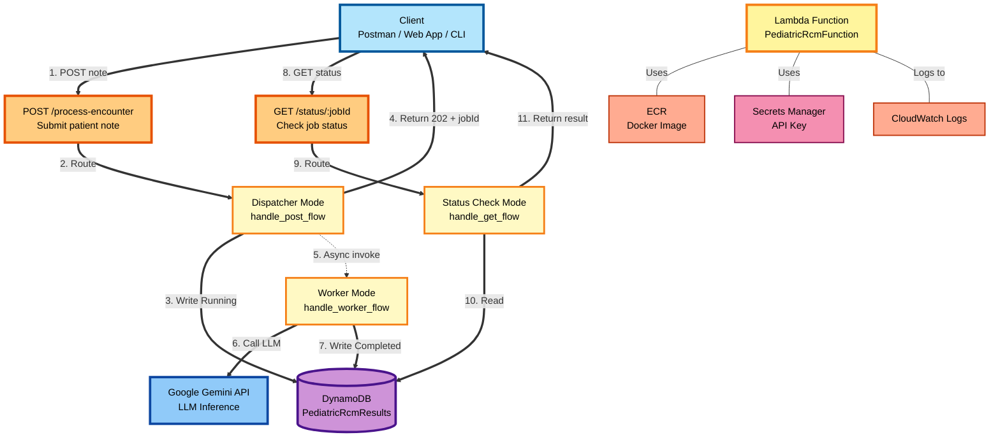
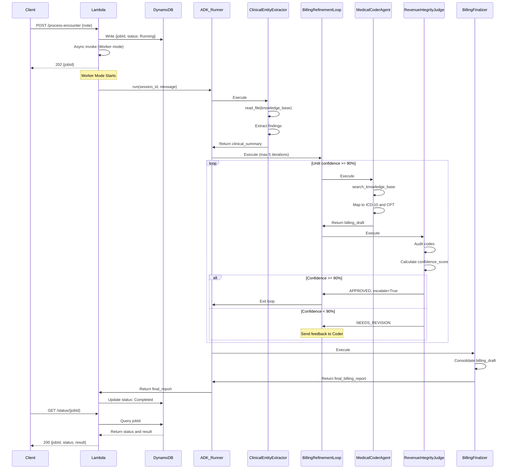
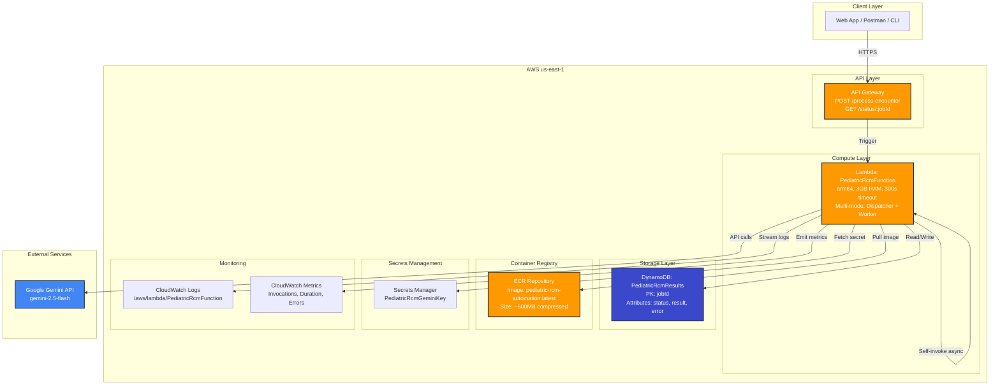

# Pediatric RCM Automation Pipeline
**An AI-powered, multi-agent medical billing system built on Google ADK + AWS Serverless**

---

## Table of Contents

- [What is this?](#what-is-this)
- [Key Concepts / What you'll learn](#key-concepts--what-youll-learn)
- [Architecture Overview](#architecture-overview)
- [AI Agents - Roles](#ai-agents---roles)
- [Tools - Roles](#tools---roles)
- [Billing Codes (Source)](#billing-codes-source)
- [UML / Diagrams](#uml--diagrams)
- [ADK Local Development Interface](#adk-local-development-interface)
- [Screenshots & Design Docs](#screenshots--design-docs)
- [Example Test Scenarios](#example-test-scenarios)
- [Testing & Verification](#testing--verification)
- [How to Run](#how-to-run)
- [Repository Map](#repository-map)
- [Cloud Deployment](#cloud-deployment)

---

## What is this?

This is a learning project I built to explore **Google ADK (Agent Development Kit)** while solving a real-world problem: automating pediatric medical billing workflows. The system reads raw physician notes, extracts clinical findings, maps them to ICD-10/CPT billing codes, audits the results, and generates a final encounter report—all orchestrated by specialized AI agents.

It's my practical playground for understanding agent orchestration patterns, context persistence, iterative refinement loops, and serverless deployment strategies. The codebase demonstrates both *local ADK development* (with live web UI) and *production AWS deployment* (Lambda + DynamoDB + API Gateway).

---

## Key Concepts

- **Multi-Agent Orchestration**: How to chain specialized agents (extractor → coder → auditor → finalizer) using ADK's `SequentialAgent` and `LoopAgent` primitives
- **Iterative Refinement Pattern**: A loop agent that keeps refining billing codes until they pass a 90%+ confidence audit
- **Stateful Context Management**: How ADK's `InMemorySessionService` persists agent outputs across the pipeline
- **Async Worker Pattern**: Decoupling client requests from long-running agent workflows using Lambda async invocations
- **Knowledge-Grounded Tools**: Custom tools that let agents search a medical billing knowledge base without hallucinating codes
- **Serverless Multi-API Design**: One API Gateway handling both client requests (`POST /process-encounter`, `GET /status/{jobId}`) and internal agent coordination
- **AWS Deployment**: Docker + ECR + Lambda + DynamoDB + SAM infrastructure-as-code

---

## Architecture Overview

### System Components



---

### Request Flow

**POST Flow (Submit Job):**
1. Client submits patient note → `POST /process-encounter`
2. API Gateway routes to **Dispatcher Mode** (Lambda)
3. Dispatcher writes `{jobId, status: "Running"}` to DynamoDB
4. Dispatcher returns `202 Accepted {jobId}` to client immediately
5. Dispatcher invokes **Worker Mode** async (non-blocking)
6. Worker calls Gemini API to process patient note
7. Worker writes `{status: "Completed", result: report}` to DynamoDB

**GET Flow (Check Status):**
8. Client polls for results → `GET /status/:jobId`
9. API Gateway routes to **Status Check Mode** (Lambda)
10. Status Check reads job data from DynamoDB
11. Status Check returns `{jobId, status, result}` to client

**Infrastructure:**
- **Lambda** pulls Docker image from ECR at startup
- **Lambda** fetches Google API key from Secrets Manager
- **Lambda** streams execution logs to CloudWatch

---

## AI Agents - Roles

The system uses four specialized AI agents orchestrated in a sequential pipeline with an iterative refinement loop:

### 1. **ClinicalEntityExtractor**
- **Role**: Parses raw physician notes and extracts structured clinical findings
- **Key Tasks**:
  - Identifies patient demographics (age, sex)
  - Extracts chief complaint and clinical findings
  - Determines laterality (Right/Left/Bilateral) for procedures
  - Maps findings to target ICD-10 and CPT code ranges
- **Output**: Clinical specification stored in `state['tech_spec']`

### 2. **MedicalCoderAgent**
- **Role**: Maps clinical findings to validated ICD-10 diagnosis codes and CPT procedure codes
- **Key Tasks**:
  - Searches knowledge base using targeted queries
  - Ensures laterality consistency (e.g., H66.001 vs H66.002 for ear infections)
  - Applies age-based logic for preventive visit codes
  - Bundles procedures according to billing rules
- **Output**: Billing draft stored in `state['billing_draft']`

### 3. **RevenueIntegrityJudge**
- **Role**: Audits billing accuracy and ensures 90%+ confidence before approval
- **Key Tasks**:
  - Verifies codes against knowledge base scenarios
  - Validates laterality, age-logic, and bundling rules
  - Calculates confidence score (deducts points for errors)
  - Triggers loop exit when score ≥90% or requests revision
- **Output**: Review status, confidence score, and feedback stored in state

### 4. **BillingFinalizer**
- **Role**: Consolidates approved billing data into final encounter report
- **Key Tasks**:
  - Formats professional encounter record
  - Includes final confidence score and approval status
  - Prepares document for insurance claim submission
- **Output**: Final billing report stored in `state['final_billing_report']`

### Agent Orchestration Pattern

```
SequentialAgent (Root)
  ├─ ClinicalEntityExtractor
  ├─ LoopAgent (BillingRefinementLoop, max 5 iterations)
  │    ├─ MedicalCoderAgent
  │    └─ RevenueIntegrityJudge (exits loop if approved)
  └─ BillingFinalizer
```

---

## Tools - Roles

The agents use specialized tools to interact with the knowledge base and file system:

### **Core Tools**

#### `read_file(path: str)`
- **Purpose**: Reads clinical notes, knowledge base files, or encounter drafts
- **Security**: Path-bounded to project root to prevent directory traversal
- **Used by**: ClinicalEntityExtractor, MedicalCoderAgent, RevenueIntegrityJudge

#### `search_knowledge_base(query: str, file_path: str)`
- **Purpose**: Performs targeted keyword search in billing manual (e.g., "Asthma", "Scenario 4")
- **Advantage**: Token-efficient alternative to reading entire knowledge base
- **Used by**: MedicalCoderAgent (code lookup), RevenueIntegrityJudge (verification)

#### `onboard_project()`
- **Purpose**: Reads README.md to provide clinic context to agents
- **Used by**: All agents during initialization

#### `write_file(path: str, content: str)`
- **Purpose**: Saves billing drafts or finalized encounter reports
- **Security**: Path validation prevents writes outside project boundaries
- **Used by**: (Optional) For persisting intermediate outputs

#### `list_git_files()`
- **Purpose**: Lists tracked repository files (excludes .venv and ignored paths)
- **Used by**: ClinicalEntityExtractor for knowledge base location verification

### **Specialized Tools**

#### `set_review_status_and_exit_if_approved(status, confidence_score, review_feedback, tool_context)`
- **Purpose**: Controls the refinement loop exit logic
- **Behavior**:
  - Sets `state['review_status']`, `state['confidence_score']`, `state['review_feedback']`
  - If status is "APPROVED" and score ≥90%, sets `tool_context.actions.escalate = True` to exit loop
  - If score <90%, returns feedback to MedicalCoderAgent for revision
- **Used by**: RevenueIntegrityJudge exclusively

### **Security Features**

All file tools use `safe_path()` function that:
- Resolves paths relative to `REPO_ROOT`
- Validates resolved path stays within project boundaries
- Raises `ValueError` if path escapes project root

---

## Billing Codes (Source)

The system uses a curated knowledge base (`knowledge_base/billing_codes.md`) containing ICD-10 diagnosis codes and CPT procedure codes specific to pediatric care.

### **ICD-10 Diagnosis Codes**

| Category | ICD-10 Code | Description |
| :--- | :--- | :--- |
| Ear Infection (Right) | **H66.001** | Acute suppurative otitis media, right ear |
| Ear Infection (Left) | **H66.002** | Acute suppurative otitis media, left ear |
| Ear Infection (Bilateral) | **H66.003** | Acute suppurative otitis media, bilateral |
| Asthma Exacerbation | **J45.51** | Severe persistent asthma with acute exacerbation |
| Strep Throat | **J02.0** | Streptococcal pharyngitis |
| Well-Child Exam | **Z00.129** | Routine child health exam without abnormal findings |
| Viral Conjunctivitis | **B30.9** | Viral conjunctivitis, unspecified |
| Acute Conjunctivitis | **H10.33** | Unspecified acute conjunctivitis, bilateral |
| Acute Bronchiolitis | **J21.0** | Acute bronchiolitis due to RSV |

### **CPT Procedure Codes**

| Service / Procedure | CPT Code | Description |
| :--- | :--- | :--- |
| Office Visit (Minimal) | **99212** | Straightforward/minimal complexity |
| Office Visit (Low-Mod) | **99213** | Low-to-moderate complexity |
| Office Visit (Mod-High) | **99214** | Moderate-to-high complexity |
| Nebulizer Treatment | **94640** | Inhalation treatment for airway obstruction |
| Rapid Strep Test | **87880** | Infectious agent antigen detection |
| Preventive (Age 1-4) | **99392** | Periodic preventive medicine (1-4 years) |
| Preventive (Age 5-11) | **99393** | Periodic preventive medicine (5-11 years) |

### **Clinical Decision Scenarios**

The knowledge base includes 6 scenarios that define bundling rules and validation logic:

1. **Acute Otitis Media (Ear Infection)**: Must verify laterality (R/L/B), map to CPT 99213
2. **Asthma Exacerbation**: Code J45.51, MUST bundle nebulizer (CPT 94640), map to CPT 99214
3. **Strep Throat**: Code J02.0, map to CPT 99213, include CPT 87880 if test performed
4. **Well-Child Visit**: Use Z00.129, CPT selection based on age (99392 for 1-4, 99393 for 5-11)
5. **Viral Conjunctivitis**: Use B30.9 or H10.33 (bilateral), map to CPT 99212
6. **Acute Bronchiolitis (RSV)**: Use J21.0, map to CPT 99214 due to high complexity

**Critical Validation Rule (Scenario 4)**: Agent must verify patient age by comparing Date of Birth with Date of Service. If age is exactly 5 years, default to CPT 99393 to avoid insurance denials.

---

## UML / Diagrams

### A) Communication Patterns (Invoker ↔ Agents)



---

### B) AWS Deployment Architecture



**Key Infrastructure Notes:**

- **Single Lambda Function**: Handles both API Gateway requests and async background processing via self-invocation
- **Docker Image**: ~500MB compressed, includes Python 3.13 runtime (ARM64), ADK libraries, all agent code, and knowledge base
- **DynamoDB Schema**: Primary key `jobId`, attributes include `status` ("Running"/"Completed"/"Failed"), `result` (final report), `error` (if failed)
- **IAM Permissions**: Managed by SAM - includes lambda:InvokeFunction, DynamoDB read/write, and Secrets Manager access
- **Cost Estimate**: Lambda ~$0.003/invocation (3GB × 60s avg), DynamoDB on-demand pricing, ECR ~$0.05/month, Gemini API varies by usage

---

## ADK Local Development Interface

The Google Agent Development Kit (ADK) provides a powerful local web interface for testing and debugging the multi-agent pipeline without deploying to AWS.

### ADK: Workflow Architecture Diagram


**Auto-generated by Google ADK** - Visual representation of the multi-agent pipeline showing:
- Sequential execution of ClinicalEntityExtractor → BillingRefinementLoop → BillingFinalizer
- Loop structure with MedicalCoderAgent and RevenueIntegrityJudge
- Tool connections and state flow between agents

---

### ADK: Agent Execution Trace - Clinical Extraction


**Phase 1: ClinicalEntityExtractor** (Orange icons)
- Calls tools: `onboard_project` → `list_git_files` → `read_file`
- Reads `knowledge_base/billing_codes.md` to ground extraction logic
- Output: Structured clinical specification with laterality, diagnosis, and target ICD-10/CPT ranges
- State Update: Stores clinical summary in `state['tech_spec']`

---

### ADK: Agent Execution Trace - Billing Refinement & Approval


**Phase 2-3: BillingRefinementLoop** (Pink/Purple icons)

**Iteration 1:**
- **MedicalCoderAgent**: 
  - Searches knowledge base 11× using targeted queries (e.g., "conjunctivitis", "bilateral", "H10.33")
  - Proposes ICD-10 H10.33 + CPT 99212
  - Stores draft in `state['billing_draft']`
- **RevenueIntegrityJudge**: 
  - Verifies codes against knowledge base scenarios
  - Calculates confidence score: 100%
  - Calls `set_review_status_and_exit_if_approved(status="APPROVED", confidence_score=100, ...)`
  - Sets `tool_context.actions.escalate = True` → Loop exits

**Phase 3: BillingFinalizer**
- Reads `state['billing_draft']` and `state['confidence_score']`
- Generates final encounter record with approval status
- Output stored in `state['final_billing_report']`

---

### How to Use ADK Locally

```bash
# 1. Install dependencies
pip install -r requirements.txt

# 2. Set environment variables
export GOOGLE_API_KEY="your-gemini-api-key"

# 3. Run ADK's local server
adk web start --agent agents.development_workflow.agent:root_agent --app-name pediatric-rcm-automation

# 4. Open http://localhost:8080 in your browser
```

**What you'll see:**
- A chat interface to submit patient notes
- Real-time agent execution logs (which agent is running, what tools are called)
- The full conversation history with `state` snapshots
- Visual workflow diagram showing agent execution flow

**Sample workflow:**
```
You: "5-year-old with right ear pain, fever, red tympanic membrane. Administered nebulizer."

[Agent Trace]
1. ClinicalEntityExtractor → Reading knowledge_base/billing_codes.md → Extracting laterality: RIGHT
2. BillingRefinementLoop (Iteration 1)
   - MedicalCoderAgent → Searching "Ear Infection Right" → Proposing H66.001 + 99213
   - RevenueIntegrityJudge → Confidence: 85% (missing nebulizer CPT) → NEEDS_REVISION
3. BillingRefinementLoop (Iteration 2)
   - MedicalCoderAgent → Adding CPT 94640 (nebulizer)
   - RevenueIntegrityJudge → Confidence: 95% → APPROVED
4. BillingFinalizer → Generating final report
```

---

## Screenshots & Design Docs

### Screenshots

**Postman: Submitting a Patient Note**


**Request:**
```json
POST https://gphrvfly1e.execute-api.us-east-1.amazonaws.com/Prod/process-encounter?hello

Headers:
  Content-Type: application/json

Body:
{
  "note": "4-year-old male presents with bilateral eye redness and watery discharge for 2 days. Mother reports crusting on eyelids upon waking in the morning. Child complains of itching but denies pain. No fever. Examination shows bilateral conjunctival injection with clear discharge."
}
```

**Response:**
```json
Status: 202 Accepted
Duration: 3.92 s

{
  "jobId": "077a5b2b-ffe3-4939-967f-be4acc51e0b9",
  "message": "Flow started"
}
```

---

**Postman: Polling Job Status**


**Request:**
```http
GET https://gphrvfly1e.execute-api.us-east-1.amazonaws.com/Prod/status/fc568861-26e5-4c19-bc52-756905640906 

Headers: (6 total - auto-generated by Postman)
```

**Response:**
```json
Status: 200 OK
Duration: 557 ms
Size: 924 B

{
  "jobId": "077a5b2b-ffe3-4939-967f-be4acc51e0b9",
  "result": "# [FINAL-ENCOUNTER-RECORD] Pediatric Associates\n\nFinal Confidence Score: 100\nFinal Status: APPROVED\n\n## 2. Billing Summary\n* **Primary ICD-10:** H10.33 - Unspecified acute conjunctivitis, bilateral\n* **Supporting CPTs:** 99212\n* **Integrity Check:** Confirming Age-logic and clinical alignment.",
  "status": "Completed"
}
```

<details>
<summary><strong>Click to view full billing report</strong></summary>

```markdown
# [FINAL-ENCOUNTER-RECORD] Pediatric Associates

Final Confidence Score: 100
Final Status: APPROVED

## 2. Billing Summary
Primary ICD-10: H10.33 - Unspecified acute conjunctivitis, bilateral
Supporting CPTs: 99212
Integrity Check: Confirming Age-logic and clinical alignment.
```

**Agent Processing Summary:**
- Clinical Entity Extractor: Identified bilateral conjunctivitis, 4-year-old male
- Medical Coder Agent: Mapped to ICD-10 H10.33 + CPT 99212
- Revenue Integrity Judge: Approved with 100% confidence score
- Billing Finalizer: Generated final encounter record

</details>

---

### Design Docs

Key architectural decisions are documented in [`docs/design-decisions.md`](./docs/design_decisions.md).

**Decisions covered:**
- **Docker + ECR**: Why we use containers instead of Lambda layers (dependency size: 320MB > 250MB limit)
- **DynamoDB**: Why we chose DynamoDB over RDS or S3 (serverless, pay-per-request, sub-10ms latency)
- **Two APIs (POST + GET)**: Why async processing is necessary (API Gateway 29-second timeout, agents take 30-90s)

Each decision includes context, rationale, trade-offs, and alternatives considered.

---

## Example Test Scenarios

The system includes test scenarios that validate different clinical decision paths and billing rules:

### Scenario 1: Asthma Exacerbation with Nebulizer Treatment

**Test File**: `test/scenarios/scenario1.json`

**Patient Note**:
```
5-year-old male with wheezing and shortness of breath. Administered nebulizer treatment.
```

**Expected Behavior**:
- **ClinicalEntityExtractor**: Identifies asthma exacerbation symptoms, notes nebulizer administration
- **MedicalCoderAgent**: Maps to ICD-10 J45.51 (Asthma Exacerbation)
- **MedicalCoderAgent**: Bundles CPT 99214 (office visit) + CPT 94640 (nebulizer) per Scenario 2 rules
- **RevenueIntegrityJudge**: Verifies nebulizer bundling (deducts 30 points if missing)
- **Confidence Target**: ≥90% approval

**What This Tests**:
- Procedural bundling logic (nebulizer MUST be included for asthma patients)
- Iterative refinement (if nebulizer omitted in first iteration, judge triggers revision)
- Scenario 2 validation rules from knowledge base

---

### Scenario 2: Insufficient Information

**Test File**: `test/scenarios/noinfo.json`

**Patient Note**:
```
hello
```

**Expected Behavior**:
- **ClinicalEntityExtractor**: Recognizes insufficient clinical data
- **MedicalCoderAgent**: Unable to map to any billing codes
- **Output**: "INSUFFICIENT DATA - MANUAL REVIEW REQUIRED"

**What This Tests**:
- Error handling for non-clinical input
- Agent ability to recognize edge cases
- Graceful degradation when no valid billing path exists

---

### Additional Scenarios (Covered in Knowledge Base)

While only two test files are present, the knowledge base defines 6 clinical scenarios that can be tested:

1. **Ear Infection with Laterality**: Tests H66.001 (right), H66.002 (left), H66.003 (bilateral) selection
2. **Strep Throat with Rapid Test**: Tests CPT 87880 bundling when antigen test performed
3. **Well-Child Visit Age Logic**: Tests age-based CPT selection (99392 for 1-4, 99393 for 5-11)
4. **Viral Conjunctivitis**: Tests bilateral vs unspecified code selection (H10.33 vs B30.9)
5. **Acute Bronchiolitis (RSV)**: Tests high-complexity visit coding (CPT 99214)

---

## Testing & Verification

### A) Local Testing

#### Unit Tests (Moto-based Integration Test)

The repo includes a full end-to-end test using AWS service mocks:

```bash
# Install test dependencies
pip install pytest moto boto3

# Run the test suite
python test/handler_test.py
```

**What this tests:**
- POST flow: Creates a job ID and stores "Running" status in DynamoDB
- Worker flow: Manually triggers the ADK pipeline (simulates async invoke)
- GET flow: Polls the job status and retrieves the final report

**Sample output:**
```
--- 1. Testing POST Flow ---
Loading scenario from: test/scenarios/scenario_1_ear_infection.json
Job Created: 5a7f3c21-8b9d-4e2a-9f1e-6d4c8b3a2e1f

--- 2. Manually Triggering Worker Flow ---
Worker execution finished.

--- 3. Testing GET Flow for Result ---
Final Report Retrieved:
[FINAL-ENCOUNTER-RECORD] Pediatric Associates
Final Confidence Score: 95
Final Status: APPROVED
...
```

### B) ADK Local Testing

You can run the agent pipeline **without AWS** using ADK's local web UI:

```bash
# 1. Install dependencies
pip install -r requirements.txt

# 2. Set environment variables
export GOOGLE_API_KEY="your-gemini-api-key"

# 3. Run ADK's local server
adk web start --agent agents.development_workflow.agent:root_agent --app-name pediatric-rcm-automation

# 4. Open http://localhost:8080 in your browser
```

**What you'll see:**
- A chat interface to submit patient notes
- Real-time agent execution logs (which agent is running, what tools are called)
- The full conversation history with `state` snapshots

**Sample workflow:**
```
You: "5-year-old with right ear pain, fever, red tympanic membrane. Administered nebulizer."

[Agent Trace]
1. ClinicalEntityExtractor → Reading knowledge_base/billing_codes.md → Extracting laterality: RIGHT
2. BillingRefinementLoop (Iteration 1)
   - MedicalCoderAgent → Searching "Ear Infection Right" → Proposing H66.001 + 99213
   - RevenueIntegrityJudge → Confidence: 85% (missing nebulizer CPT) → NEEDS_REVISION
3. BillingRefinementLoop (Iteration 2)
   - MedicalCoderAgent → Adding CPT 94640 (nebulizer)
   - RevenueIntegrityJudge → Confidence: 95% → APPROVED
4. BillingFinalizer → Generating final report
```

### C) AWS Deployment Testing

After deploying to AWS (see [Cloud Deployment](#cloud-deployment)), test the live API:

#### Health Check (Smoke Test)

```bash
# Get your API URL from SAM output
export API_URL="https://abcd1234.execute-api.us-east-1.amazonaws.com/Prod"

# Test POST endpoint
curl -X POST $API_URL/process-encounter \
  -H "Content-Type: application/json" \
  -d '{"note": "5-year-old with right ear pain"}'

# Expected response:
# {"jobId": "uuid-here", "message": "Flow started"}
```

#### End-to-End Workflow Test

```bash
# 1. Submit a job
JOB_ID=$(curl -s -X POST $API_URL/process-encounter \
  -H "Content-Type: application/json" \
  -d '{"note": "7-year-old with bilateral ear infection, fever 101F, red tympanic membranes"}' \
  | jq -r '.jobId')

echo "Job ID: $JOB_ID"

# 2. Poll status (repeat until status is "Completed")
curl -s $API_URL/status/$JOB_ID | jq .

# 3. Verify the result contains expected codes
curl -s $API_URL/status/$JOB_ID | jq -r '.result' | grep "H66.003"  # Bilateral ear infection
```

#### CloudWatch Logs

```bash
# Stream Lambda logs
sam logs --name PediatricRcmFunction --stack-name PediatricRcmAutomationStack --tail

# Look for:
# - "[AGENT: ClinicalEntityExtractor] processing..."
# - "WORKER SUCCESS: Job {jobId} complete."
```

---

## How to Run

### A) Local (Python + ADK CLI)

**Prerequisites:**
- Python 3.13+ (matches Lambda runtime)
- Google Gemini API key ([get one here](https://ai.google.dev/))

**Setup:**

```bash
# 1. Clone the repo
git clone https://github.com/tarikkatasoy/pediatric-rcm-automation.git
cd pediatric-rcm-automation

# 2. Install dependencies
pip install -r requirements.txt

# 3. Set environment variables
export GOOGLE_API_KEY="your-gemini-api-key"
export RESULTS_TABLE="PediatricRcmResults"  # Dummy value for local testing
export AWS_DEFAULT_REGION="us-east-1"       # Dummy value for local testing
```

**Run ADK Web UI:**

```bash
adk web start --agent agents.development_workflow.agent:root_agent --app-name pediatric-rcm-automation
```

Open http://localhost:8080 and submit a patient note:

```
7-year-old with bilateral ear infection, fever 101F, red tympanic membranes. Administered nebulizer.
```

**Run Unit Tests:**

```bash
python test/handler_test.py
```

---

### B) ADK (Agent Development Kit Local Mode)

If you want to test the agents in isolation (without the Lambda handler):

```bash
# 1. Ensure GOOGLE_API_KEY is set
export GOOGLE_API_KEY="your-gemini-api-key"

# 2. Start ADK web server
adk web start --agent agents.development_workflow.agent:root_agent

# 3. Open http://localhost:8080
```

**Tip:** The ADK web UI shows:
- Which agent is currently running
- What tools it's calling (`read_file`, `search_knowledge_base`, etc.)
- The intermediate `state` after each agent completes

---

## Repository Map

```
pediatric-rcm-automation/
├── agents/                          # ADK agent definitions
│   └── development_workflow/
│       ├── agent.py                 # Root agent (SequentialAgent + LoopAgent)
│       ├── common_tools.py          # Shared tools (read_file, search_knowledge_base)
│       └── subagents/
│           ├── clinical_entity_extractor/
│           │   └── agent.py         # Extracts clinical findings from notes
│           ├── medical_coder/
│           │   └── agent.py         # Maps findings → ICD-10 + CPT codes
│           ├── revenue_integrity_judge/
│           │   ├── agent.py         # Audits billing accuracy
│           │   └── tools.py         # set_review_status_and_exit_if_approved()
│           └── billing_finalizer/
│               └── agent.py         # Generates final encounter report
│
├── knowledge_base/
│   └── billing_codes.md             # Master reference: ICD-10 + CPT codes + scenarios
│
├── test/
│   ├── handler_test.py              # Full end-to-end test (POST → Worker → GET)
│   └── scenarios/                   # Sample patient notes for testing
│       ├── scenario1.json           # Asthma exacerbation with nebulizer
│       └── noinfo.json              # Insufficient data test case
│
├── docs/
│   └── design_decisions.md          # Architectural decision records
│
├── images/                          # Screenshots and diagrams
│   ├── Postman_PostApi.png
│   ├── Postman_GetApi.png
│   ├── GoogleAdk_Sample_Workflow_Diagram.png
│   ├── GoogleAdk_TraveView_1.png
│   └── GoogleAdk_TraveView_2.png
│
├── handler.py                       # AWS Lambda entry point (multi-mode routing)
├── Dockerfile                       # Containerizes the app for Lambda
├── template.yml                     # SAM/CloudFormation infrastructure definition
├── samconfig.toml                   # SAM deployment configuration (stack name, region, ECR)
├── requirements.txt                 # Python dependencies (ADK, google-genai, boto3)
├── .gitignore                       # Excludes .venv, .aws-sam, etc.
├── .samignore                       # Excludes files from SAM build
└── README.md                        # You are here
```

---

## Cloud Deployment

### Prerequisites

- AWS CLI configured ([setup guide](https://docs.aws.amazon.com/cli/latest/userguide/getting-started-install.html))
- SAM CLI installed ([install SAM](https://docs.aws.amazon.com/serverless-application-model/latest/developerguide/install-sam-cli.html))
- Docker Desktop running
- IAM permissions for:
  - CloudFormation
  - Lambda
  - API Gateway
  - DynamoDB
  - ECR
  - Secrets Manager

---

### Step 1: Store Your Google API Key in Secrets Manager

```bash
aws secretsmanager create-secret \
  --name PediatricRcmGeminiKey \
  --secret-string '{"API_KEY":"your-actual-gemini-api-key"}' \
  --region us-east-1
```

---

### Step 2: Build & Deploy with SAM

```bash
# Build the Docker image and package the Lambda function
sam build

# Deploy (first time: creates ECR repo, DynamoDB table, API Gateway)
sam deploy --guided

# Follow the prompts:
# - Stack Name: PediatricRcmAutomationStack
# - AWS Region: us-east-1
# - Confirm changes before deploy: Y
# - Allow SAM CLI IAM role creation: Y
# - Disable rollback: N (recommended for production; we use Y for dev)
# - PediatricRcmFunction may not have authorization defined: Y
# - Save arguments to configuration file: Y
```

SAM will:
1. Build the Docker image (using [`Dockerfile`](./Dockerfile))
2. Create an ECR repository (auto-named by SAM)
3. Push the image to ECR
4. Deploy a CloudFormation stack with:
   - Lambda function (3GB RAM, 300s timeout, arm64 architecture)
   - API Gateway (with `/process-encounter` and `/status/{jobId}` routes)
   - DynamoDB table (`PediatricRcmResults`)
5. Output the API URL

---

### Step 3: Get Your API URL

```bash
aws cloudformation describe-stacks \
  --stack-name PediatricRcmAutomationStack \
  --query "Stacks[0].Outputs[?OutputKey=='ApiUrl'].OutputValue" \
  --output text
```

Save this URL as `API_URL` for testing.

---

### Step 4: Test the Deployment

```bash
export API_URL="https://your-api-id.execute-api.us-east-1.amazonaws.com/Prod"

# Submit a test job
curl -X POST $API_URL/process-encounter \
  -H "Content-Type: application/json" \
  -d '{"note": "5-year-old with right ear pain, fever, red tympanic membrane"}'

# Get the jobId from the response, then poll status:
curl $API_URL/status/{jobId}
```

---

### Step 5: Redeploy After Code Changes

```bash
# Rebuild + redeploy (no --guided needed after first deploy)
sam build && sam deploy
```

---

### Step 6: View Logs

```bash
sam logs --name PediatricRcmFunction --stack-name PediatricRcmAutomationStack --tail
```

---

