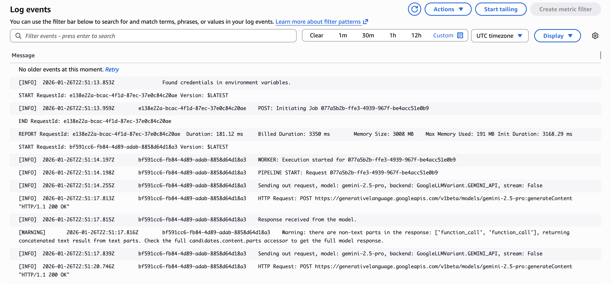
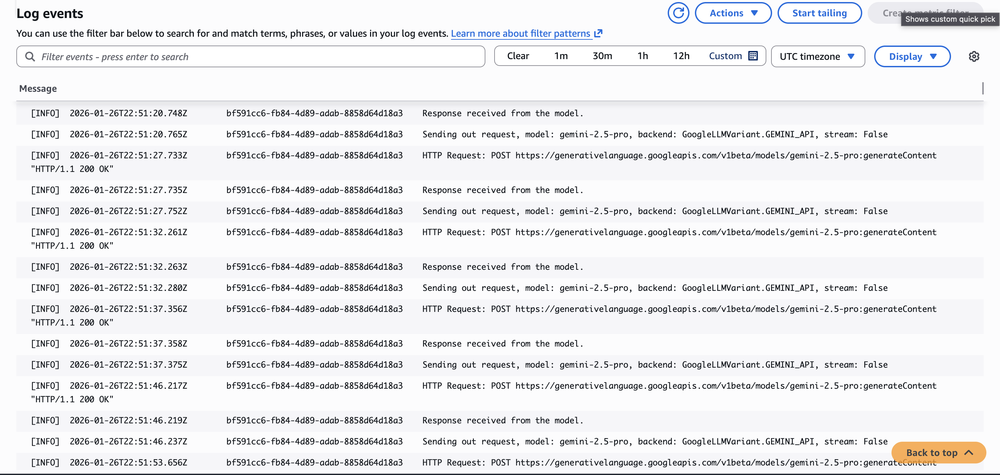
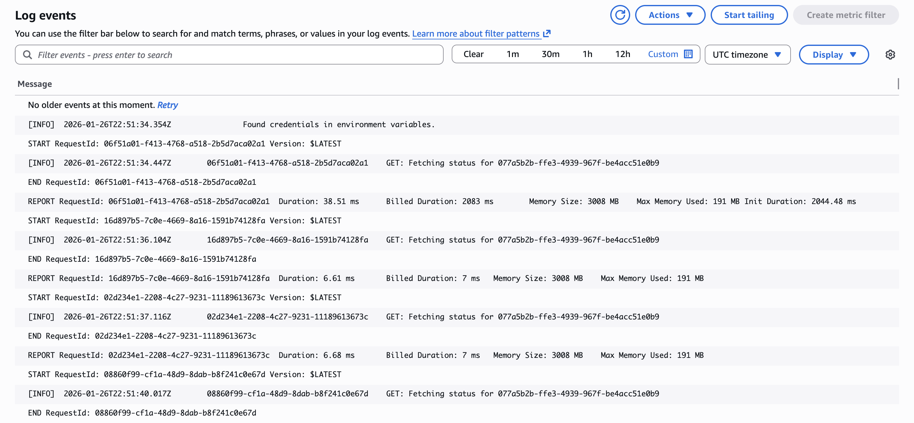

# System Verification and Monitoring

This document contains visual evidence of the system's execution, monitoring, and testing.

## 1. AWS CloudWatch Logs
Execution logs demonstrating the workflow steps in the cloud environment.

### POST Request Execution Logs

*Figure 1: Initial POST request received - Lambda dispatcher creates jobId and initiates async worker invocation.*

*Figure 2: Worker execution started - ADK pipeline initialization and ClinicalEntityExtractor processing.*

*Figure 3: Agent refinement loop - MedicalCoderAgent and RevenueIntegrityJudge iterative processing.*

### GET Request Execution Logs

*Figure 4: Status check request - Lambda queries DynamoDB and returns completed billing report.*

---

## 2. ADK Web Interface
Visualizations from the Agent Development Kit (ADK) showing the agent interactions.

*Figure 5: Auto-generated workflow diagram showing multi-agent pipeline structure (SequentialAgent with nested LoopAgent).*

*Figure 6: ClinicalEntityExtractor phase - Tool calls (onboard_project, list_git_files, read_file) and clinical spec generation.*

*Figure 7: BillingRefinementLoop execution - Knowledge base searches (11x), code proposal, audit verification, and approval.*

---

## 3. Postman API Testing
API endpoint testing results ensuring correct HTTP responses.

*Figure 8: POST /process-encounter - Job creation with 202 Accepted response (Duration: 3.92s, jobId returned).*

*Figure 9: GET /status/{jobId} - Completed job retrieval with 200 OK response (Duration: 557ms, final billing report returned).*

---

